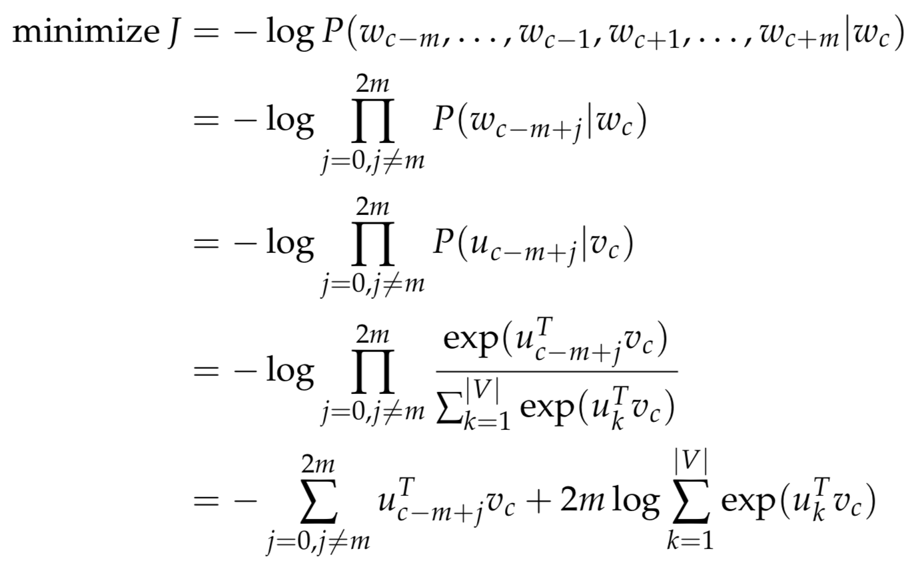
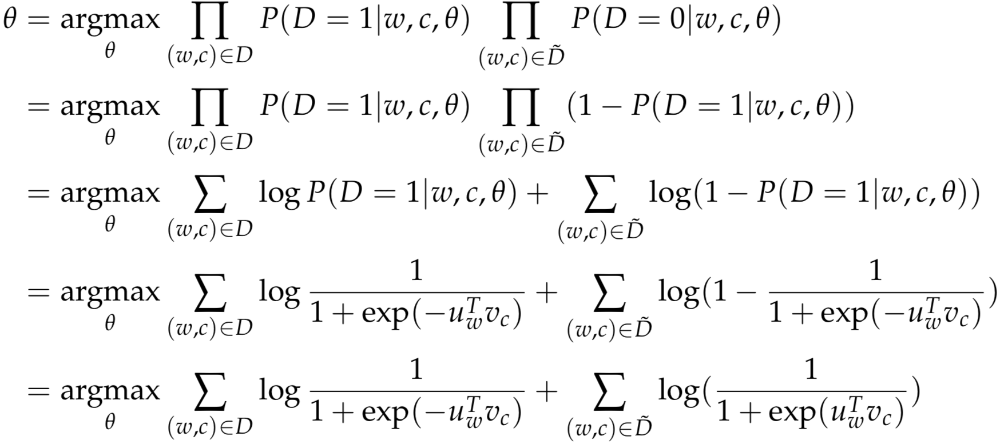

# -
基于numpy, sklearn, tensorflow==2.0.1实现tf-idf, word2vec

很上面提到的模型对应的另一种思路，是以中心的词语"jumped"为输入，能够预测或产生它周围的词语"The", "cat", ’over", "the”, "puddle"等。这里我们叫"jumped"为上下文。我们把它叫做Skip-Gram 模型。
这个模型的建立与连续词袋模型（CBOM）非常相似，但本质上是交换了输入和输出的位置。我们令输入的one-hot向量（中心词）为x（因为它只有一个），输出向量为y(j)。U和V的定义与连续词袋模型一样。

Skip-Gram 模型中的各个记号：

* $w_i$:单词表V中的第i个单词
* $v\in R^{n*|V|}$：输入词矩阵
* $v_i$：V的第i列，单词$w_i$的输入向量
* $u\in R^{|V|*n}$：输出词矩阵
* $u_i$：U的第i行，单词$w_i$的输出向量

对应到上面部分，我们可以把Skip-Gram 模型的运作方式拆分成以下几步：

1.	生成one-hot输入向量x。
2.	得到上下文的嵌入词向量$v_c=Vx$。
3.	因为这里不需要取平均值的操作，所以直接是$\hat v=v_c$。
4.	通过$u=Uv_c$产生2m个得分向量$u_{c-m},\cdots,u_{c-1},u_{c+1},\cdots,u_{(c+m)}$。
5.	将得分向量转换成概率分布形式$y=softmax(u)$。
6.	我们希望我们产生的概率分布与真实概率分布$y^{c-m},\cdots,y^{c-1},,y^{c+1}\cdots,y^{c+m}$ 相匹配，也就是我们真实输出结果的one-hot向量。

像连续词袋模型一样，我们需要为模型设定一个目标/损失函数。不过不同的地方是我们这里需要引入朴素贝叶斯假设来将联合概率拆分成独立概率相乘。如果你之前不了解它，可以先跳过。这是一个非常强的条件独立性假设。也就是说只要给出了中心词，所有的输出词是完全独立的。

我们可以用随机梯度下降法去更新未知参数的梯度。

#### 负例采样（Negative Sampling）
我们再次观察一下目标函数，注意到对整个单词表|V|求和的计算量是非常巨大的，任何一个对目标函数的更新和求值操作都会有O(|V|)的时间复杂度。我们需要一个思路去简化一下，我们想办法去求它的近似。
对于每一步训练，我们不去循环整个单词表，而只是抽象一些负面例子就够了！我们可以从一个噪声分布$(P_n(w))$中抽样，其概率分布与单词表中的频率相匹配。为了将描述问题的公式与负例采样相结合，我们只需要更新我们的：

* 目标函数
* 梯度
* 更新规则

Mikolov ET AL.在他的《Distributed Representations of Words and Phrases and their Compositionality》中提出了负例采样。虽然负例采样是基于Skip-Gram 模型，它实际上是对一个不同的目标函数进行最优化。考虑一个“词-上下文”对（w,c），令P(D = 1|w, c)为(w, c)来自于语料库的概率。相应的，P(D = 0|w, c) 则是不来自于语料库的概率。我们首先对P(D = 1|w, c)用sigmoid函数建模：
$$p(D=1|w,c,\theta)= {1\over{1+e^{(-v_c^Tv_w)}}}$$
现在我们需要建立一个新的目标函数。如果(w, c)真是来自于语料库，目标函数能够最大化P(D = 1|w, c)。反之亦然。我们对这两个概率采用一个简单的最大似然法。（这里令θ为模型的参数，在我们的例子中，就是对应的U和V。）

注意这里的$\widetilde D$表示“错误的”或者“负面的”语料库，像句子"stock boil fish is toy"就是从这样的语料库来的。不自然的句子应该有比较低的发生概率，我们可以从词库中随机采样来产生这样的“负面的”语料库。我们的新目标函数就变成了：

$$log\sigma(u_(c-m+j)^T.v_c)+\sum_{k=1}^Klog\sigma(-\widetilde u_k^T.v_c)$$

在这里$\{\widetilde u_k|k=1,\cdots,K\}$是从(Pn(w))中抽样取到的。需要多说一句的是，虽然关于怎么样最好地近似有许多讨论和研究，但是工作效果最好的似乎是指数为3/4的一元语言模型。至于为什么是3/4，下面有几个例子来帮助大家感性地理解一下：

$$is:0.9^{3/4}=0.92\\
constitution:0.09^{3/4}=0.16 \\
bombastic:0.01^{3/4}=0.032$$

你看，经过3/4这样一个指数处理，"Bombastic"(少见)被采样的概率是之前的3倍，而“is”这个词(多见)被采样的概率只是稍微增长了一点点。

### 词向量的作用与获取

很多高阶的深度学习自然语言处理任务，都可以用词向量作为基础。很多任务，可以用预训练好的word2vec初始化。可以从[开源链接](https://github.com/Embedding/Chinese-Word-Vectors)获取。

